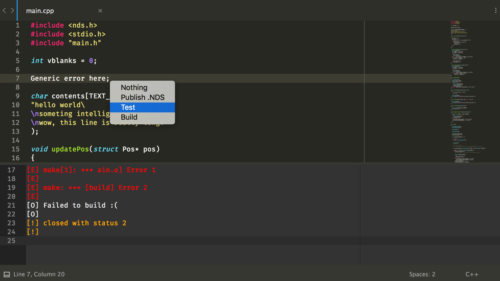

# mstaskm for Sublime Text

[mstaskm](https://github.com/liam4/mstaskm) stands for "mobile shell task manager". We all (probably) know that "mobile" means "gets around", but mstaskm doesn't work in Sublime Text - only web browsers!

As someone who uses Sublime practically every day, and does not always have access to a web browser (gotta have that split-screen space!), this simple Sublime Text plugin is handy.

## Installation

Download this folder and stick it in your `Packages` folder.

I've only tested it on a Mac so it probably only works on a Mac. That's generally how developing (anything) is.

You obviously also need to set up [mstaskm](https://github.com/liam4/mstaskm).

## Credits and Whatever

I guess I stole [websocket-client](https://pypi.python.org/pypi/websocket-client/) and also [six](https://pypi.python.org/pypi/six) as a dependency for that.
